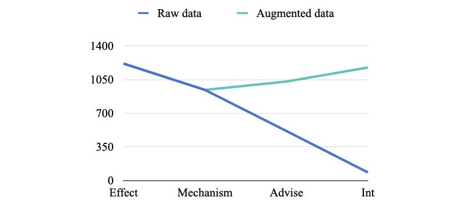

# Drug-Drug Interaction

## Quick links

- [Introduction](#introduction)
- [Dataset demo](#dataset-demo)
  - [\<document\> element](#21-document-element)
  - [\<sentence\> element](#22-sentence-element)
  - [\<entity\> element](#23-entity-element)
  - [\<ddi\> element](#24-ddi-element)
- [Methodology](#methodology)
- [Results](#results)

## Introduction

The task of DDIs includes two parts: Named Entity Recognition (NER) and Drug-Drug Interaction (DDI). The main work focuses on DDI.

The DDI corpus is a semantically annotated corpus of documents describing drug-drug interactions from the DrugBank database and MedLine abstracts on the subject of drug-drug interactions. This corpus is intended for training Information Extraction (IE) systems which are interactions from biomedical literature.

The use of the DDI corpus is subject to the terms of the DDI licence.

DrugBank training set contains **572 documents** and **5675 sentences**.

|Type|DrugBank|MedLine|DDIs|DrugBank|MedLine|
|---|---|---|---|---|---|
|drug|8197|1228|ddi|178|10|
|brand|1423|14|advice|819|8|
|group|3206|193|effect|1548|152|
|drug_n|103|401|mechanism|1260|8162|

## Dataset demo

An example of an annotated sentence within the XML file is shown below:

```xml
<sentence id="DDI-DrugBank.d42.s5" text="if a patient requires TIKOSYN and anti-ulcer therapy, it is suggested that omeprazole, ranitidine, or antacids (aluminum and magnesium hydroxides) be used as alternatives to cimetidine, as these agents have no effect on the pharmacokinetic profile of TIKOSYN.">
	<entity id="DDI-DrugBank.d42.s5.e0" charOffset="22-28" type="brand" text="TIKOSYN"/>
	<entity id="DDI-DrugBank.d42.s5.e1" charOffset="34-43" type="group" text="anti-ulcer"/>
	<entity id="DDI-DrugBank.d42.s5.e2" charOffset="75-84" type="drug" text="omeprazole"/>
	<entity id="DDI-DrugBank.d42.s5.e3" charOffset="87-96" type="drug" text="ranitidine"/>
	<entity id="DDI-DrugBank.d42.s5.e4" charOffset="102-109" type="group" text="antacids"/>
	<entity id="DDI-DrugBank.d42.s5.e5" charOffset="112-119;135-143" type="drug" text="aluminum hydroxides"/>
	<entity id="DDI-DrugBank.d42.s5.e6" charOffset="125-143" type="drug" text="magnesium hydroxides"/>
	<entity id="DDI-DrugBank.d42.s5.e7" charOffset="174-183" type="drug" text="cimetidine"/>
	<entity id="DDI-DrugBank.d42.s5.e8" charOffset="251-257" type="brand" text="TIKOSYN"/>
</sentence>
```

### 2.1 \<document\> element

The root element is the \<document\> element with the following attributes:

- **id:** an unique id which is composed by the name of the corpus (DDI-DrugBank or DDI-MedLine) and an identifier beginning with "d" and followed by a number.

### 2.2 \<sentence\> element

Each sentence of the document is contained within a \<sentence\> element. Each \<sentence\> element has the following attributes:

- **id:** A unique id which is composed by the name of the corpus (DDI-DrugBank or DDI-MedLine), the id of the document (d505), and an id beginning with "s" and followed by the index of the sentence (the index of the first sentence should be 0).
- **text:** Contains the text of the sentence.

### 2.3 \<entity\> element

Each \<entity\> element has the following attributes:

- **id:** A unique id which is composed by the name of the corpus (DDI-DrugBank or DDI-MedLine), the id of the document (d505), the id of the sentence, and an id beginning with "e" and following by the index of the entity in the sentence (the first entity of the sentence should have the index 0).
- **charOffsets:** contains the start and end positions, separated by a dash, of the mention in the sentence. When the mention is a discontinuous name, it will contain the start and end positions of all parts of the mention separated by semicolon.
- **text:** stores the text of the mention.
- **type:** stores the type of the pharmacological substance (drug, brand, group or no-human).

### 2.4 \<ddi\> element

Each \<ddi\> element has the following attributes:

- **id:** A unique id which is composed by the name of the corpus (DDI-DrugBank or DDI-MedLine), the id of the document (d505), the id of the sentence, and an id beginning with "d" and followed by the index of the ddi in the sentence (the first ddi of the sentence should have the index 0).
- **e1:** stores the id of the first interacting entity.
- **e2:** stores the id of the second interacting entity.
- **type:** stores the type of the drug-drug interaction (ddi, advice, effect, mechanism).

## Methodology

We make further advance on R-BERT ([Enriching Pre-trained Language Model with Entity Information for Relation Classification](https://arxiv.org/abs/1905.08284)).

First of all, following the algorithm written in paper:

1. **Get three vectors from BERT.**
	- [CLS] token vector
	- averaged entity_1 vector
	- averaged entity_2 vector
2. **Pass each vector to the fully-connected layers.**
	- dropout -> tanh -> fc-layer
3. **Concatenate three vectors.**
4. **Pass the concatenated vector to fully-connect layer.**
	- dropout -> fc-layer

Besides, we also do some contributes:

**Data augementation.** Because of long-tail relation problem, though only four relation types in DDI corpus, the distribution is still uneven. So we make data augementation by coping data with fewer types of relations multiple times. Hence we got a relatively even data (each type of label is about 1,000).

<div align="center"></div>

**Marker mechanism.** Not only we put `entity_start` and `entity_end` tag around certain entity, but also append entity label behind like:

```txt
# Raw data
Concurrent administration of oxyphenbutazone and androgens may result in elevated serum levels of oxyphenbutazone.

# Data with marker
Concurrent administration of <e1:drug> oxyphenbutazone </e1:drug> and <e2:group> androgens </e2:group> may result in elevated serum levels of oxyphenbutazone.
```

## Results

Use following command to train & evaluate:

```python
python main.py --do_train --do_eval
```

Final results:

```txt
+------------------------------------------------------------------------------------------------+
|            |       Without marker      |     Marker on dev-data    |    Marker on test-data    |
+------------+---------------------------+---------------------------+---------------------------+
|     total: | p=86.5%  r=83.3%  f=84.7% | p=92.1%  r=88.3%  f=90.1% | p=89.5%  r=89.8%  f=89.6% |
|            |                           |                           |                           |
|    advise: | p=87.9%  r=75.6%  f=81.3% | p=93.2%  r=95.8%  f=94.5% | p=90.1%  r=91.7%  f=90.9% |
|    effect: | p=77.3%  r=80.6%  f=78.9% | p=89.9%  r=82.9%  f=86.2% | p=88.4%  r=87.6%  f=88.0% |
|       int: | p=86.0%  r=44.8%  f=58.9% | p=96.2%  r=92.6%  f=94.4% | p=87.4%  r=98.7%  f=92.7% |
| mechanism: | p=84.1%  r=78.8%  f=81.4% | p=92.1%  r=85.4%  f=88.7% | p=91.7%  r=88.4%  f=90.1% |
+------------------------------------------------------------------------------------------------+
```
